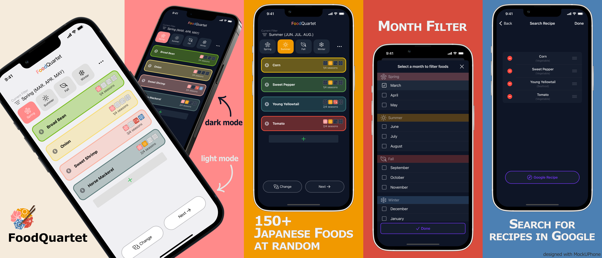

FoodQuartet
===========
This app helps you cook a meal using seasonal foods in Japan.  
You can choose from a random food list filtered by season or month, then search for the recipes on Google.

#### Download
The download on the App Store is only available in certain countries.

Stack
-----
- Swift
- UIKit

#### Libraries Used:
- [SwiftCSV](https://github.com/swiftcsv/SwiftCSV) - ver.0.9.1

License
-------
This project is licensed under the terms of the [MIT License](https://opensource.org/licenses/MIT).  

See the [LICENSE](./LICENSE) file.

___